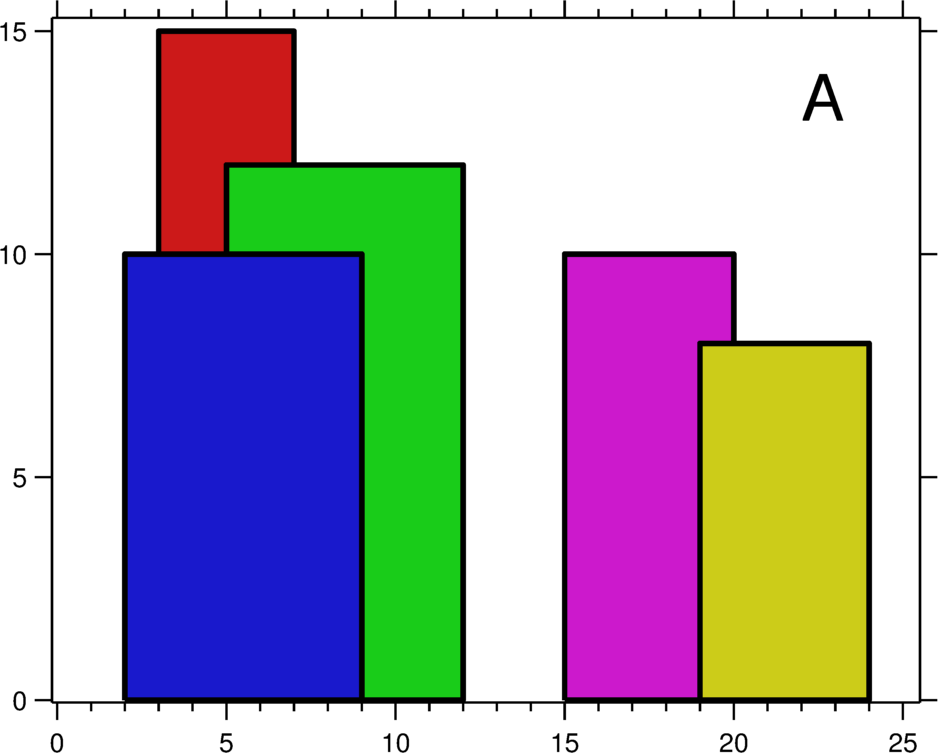

# Gull Code 2019 Problems

Problems from the 2019 Gull Code Competition at SU.  (None of the files included were coded at the competition, these are practice files)

Each of these problems were completed without internet sources, otherwise it wouldn't even be practice.  I coded them in both C++ and Python, giving myself limited time to work on these and attempted to make them as efficient as possible (tested each input/output on the old Gull Code 2019 link from the actual competition to ensure completeness).  This is mostly just practice for Gull Code 2020, so any problems that are incomplete/broken will eventually be fixed.  Below are my team's actual statistics at the competition:

## Gull Code 2019 (November 16) Results

Competition Information (my first ever coding comp!):

- Team Members: myself (CS & DS double major, sophomore), Ian Thomas (CS major & web dev god, junior), Michael Mandulak (CS major, junior).
- Team Name: Stable Marriage.
- Language & tech used: C++, Ian's macbook air, a sick gaming keyboard & mouse, and a mousepad.

Competition Results:

- Team Score & Standing: 251/600, 5th/17th place.
- Problems Completed: (5) Nth Prime, (7) Bulls & Heifers, (8) Rainfall, (12) Out of the box adding, (2) Count Down.
- Problems Nearly Completed: (6) 101doors, (4) SkyScraper Skyline.
- Problems Attempted & Missed: (1) Knights Tour, (9) Paper Strip Game.
- Problems Not Attempted: (3) Loopy Robots, (10) SAT Problem, (11) Random Dataset Linear Regression.

## Problem List

### (1) Knight's Tour

In the game of chess, a knight can move in a very special way. It travels a total of three spaces per move in an 'L' shape fashion. For example, if the knight is in square (1, 1) on an empty standard 8x8 chessboard, it can move it down two and right one (3, 2), or right two and down one. (2, 3). 

Your task is to calculate all series of 64 legal knight moves that result in the knight visiting every square on the chessboard exactly once, when the knight starts from a given coordinate. This is known as the Knight's Tour. The input is the starting row and column (starting at 1) of the knight, the output should be the number of possible paths that the Knight's Tour can follow.

Sample Input: 1 1

Sample Output:2

### (2) Count Down

Sometimes you ask, "How long until my 21st birthday?" or, "When does Thanksgiving Break start?". Your task is to count down how far away a certain date is from today, Nov. 16th, 2019. Input will be 3 integers consisting of YYYY MM DD, and output should be an integer representing the number of days away it is.

Output is # days from the start date to the end date, but not including the end date.

Sample Input: 2019 11 20

Sample Output: 4

### (3) Loopy Robots

We have a robot that has been deployed on an infinite plane at position (0, 0) facing North. It is programmed to indefinitely execute a command string. He has been programmed with the following commands:

F: Step one in the direction that he is facing

(+): Rotate 90 degrees clockwise

(-): Rotate 90 degrees counter-clockwise

When the execution reaches the end of the command string, it repeats.

Your job is to determine if a command string results in the robot repeating the same path, or not. In simpler terms, will the robot "loop" on any set of coordinates? The input will consist one string with a combination of the letters: "F", "+", "-". Your output should contain 0 if there is not a loop, and 1, #number of command strings it took to reach the loop, if there is a loop.

Note: Not all command strings will contain at least one of each instruction

Sample Input 1: F+

Sample Output 1: 1 4

Sample Input 2: F

Sample Output 2: 0

### (4) SkyScraper Skyline

A city's skyline is the outer contour of the silhouette formed by all the buildings in that city when viewed from a distance. Now suppose you are given the locations and height of all the buildings as shown on a cityscape photo (Figure A), write a program to output the skyline formed by these buildings collectively (Figure B). The geometric information of each building is represented by a triplet of integers [Li, Ri, Hi], where Li and Ri are the x coordinates of the left and right edge of the ith building, respectively, and Hi is its height. It is guaranteed that 0 ≤ Li, Ri ≤ INT_MAX, 0 < Hi ≤ INT_MAX, and Ri - Li > 0. You may assume all buildings are perfect rectangles grounded on an absolutely flat surface at height 0.

Figure A                   |  Figure B
:-------------------------:|:-------------------------:
          |  

Your goal is to output a list of "key points" (red dots in Figure B) in the format of [ [x1,y1], [x2, y2], [x3, y3], ... ] that uniquely defines a skyline. A key point is the left endpoint of a horizontal line segment. Note that the last key point, where the rightmost building ends, is merely used to mark the termination of the skyline, and always has zero height. Also, the ground in between any two adjacent buildings should be considered part of the skyline contour.

Sample Input: 2 9 10 3 7 15 5 12 12 15 50 10 19 24 8

Sample Output: 2 10 3 15 7 12 12 0 15 10 20 8 24 0

### (5) Nth Prime

Given a number, n, your job is to output the nth prime number. 

Sample Input: 100

Sample Output: 541

### (6) 101 Doors

Given 101 shut doors, your job is to toggle (if open, close it; if closed, open it) the doors each time you pass through. However, each pass you will be toggling different doors. 

- Pass 1: Toggle every door
- Pass 2: Toggle every second door
- Pass 3: Toggle every third door
- Pass n: Toggle every nth door

Continue this until you only visit the 101th door. What state are the doors in after the last pass?

The input for the problem will be 0, 1, or 2. If it is 0, then all doors should be displayed. If it is 1, then only open doors should be displayed, if it is 2, then only closed doors should be displayed. 

Print number of door, a space, and 0 if closed 1 if open. Separate each door be a new line.

### (7) Bulls & Heifers

On a sheet of paper, the players each write a 4-digit secret number. The digits must be all different. Then, in turn, the players try to guess their opponent's number who gives the number of matches. If the matching digits are in their right positions, they are "bulls", if in different positions, they are "cows". Example:

- Secret number: 4271
- Opponent's try: 1234
- Answer: 1 bull and 2 cows. (The bull is "2", the cows are "4" and "1".)

The first one to reveal the other's secret number in the least number of guesses wins the game. Your task is to implement the game, which generates the string of integers and lets judges play the game to guess the string. The game should will terminate when the player wins.

Please submit your code for this problem, and the judges will reply with a code if it is correct.

### (8) Rainfall

Given n non-negative integers representing an elevation map where the width of each bar is 1, compute how much water it is able to trap after raining.

Example:

Input: 2 0 2
Output: 2

Structure is like below
| |
|_|
We can trap 2 units of water in the middle gap.

Sample Input: 0 1 0 2 1 0 1 3 2 1 2 1

Sample Output: 6

### (9) Paper Strip Game

Two players start with a strip of n white squares and they take alternate turns.

On each turn, a player picks two contiguous white squares and paints them black.
The first player who cannot make a move loses.

If n = 1, there are no valid moves, so the first player loses automatically.
If n = 2, there is only one valid move, after which the second player loses.
If n = 3, there are two valid moves, but both leave a situation where the second player loses.
If n = 4, there are three valid moves for the first player; she can win the game by painting the two middle squares.
If n = 5, there are four valid moves for the first player (shown below in red); but no matter what she does, the second player (blue) wins.

How many values of x are possible for the first player to force a win, for any given n where 0>n>100,000?

Sample Input: 50

Sample Output: 40

### (10) SAT Problem

The Boolean satisfiability problem (SAT) is a decision problem, whose instance is a Boolean expression written using only AND, OR, NOT, variables, and parentheses. The problem is: given the expression, is there some assignment of TRUE and FALSE values to the variables that will make the entire expression true? A formula of propositional logic is said to be satisfiable if logical values can be assigned to its variables in a way that makes the formula true.

Your job is to read in a boolean expression and determine is the it is satisfiable. If it is not, your output should be 0. If it is, your output should be 1, followed by the variables' initial assignments that make it satisfiable.

Here is your alphabet:

Negation (-)
Conjunction (&)
Disjunction (V)
XOR (+)
Implies (->)
Equivalence (<=>)

Example:
Input: (-a -> b) & -a & b

Output: 1 a 0 b 1

### (11) Random Dataset Linear Regression

For this problem you are given a data set of an x value followed by a y value. Your job is to find the line of best fit, y=mx+b with the given data.

This 'step' is simply to generate your data set. Submit your code and we will judge it.

Bonus: If you are able to make code with multiple linear regression (more than one x), you get more points.

(There is a link to the dataset in the Random Dataset Linear Regression Folder)

### (12) Out Of The Box Adding

Write a program that reads in two integers and adds them together, but you are not allowed to use a+b or a-b. Instead you can only use ++, - -, >, <, =, ==. (In python += 1 and -= works instead of ++ and --)

Sample Input: 8 -11

Sample Output: -3
